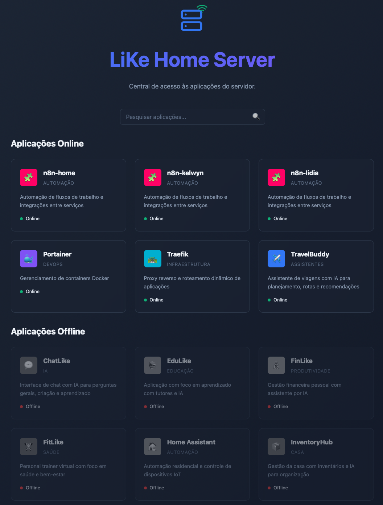

# 🏡 LiKe Home Server Portal

---

## 💡 About the Project

The **LiKe Home Server Portal** is a centralized portal designed to manage and access my self-hosted applications. It provides an intuitive interface to display the status of my applications (online/offline) and quickly find them, making my home server environment more efficient to navigate.

---

## 🖼️ Preview



---

## 🧠 Features

- **Application Portal:** A web interface to list and access all my applications.
- **Filtering and Search:** Quickly search my applications by name, description, or category.
- **Responsive Design:** Adapts seamlessly to various screen sizes.
- **Easy Setup:** Managed via Docker and Nginx for simplified deployment.

---

## ⚙️ How to Set Up and Run

This project leverages **Docker** and **Nginx** for efficient deployment.

---

### 1️⃣ Prerequisites

- **Docker** and **Docker Compose** installed on server.
- A `traefik-net` Docker network configured (or adjust `docker-compose.yml` to match your network setup).

---

### 2️⃣ Project Structure

Ensure your file structure on the server matches this:

```
.
├── docker-compose.yml
├── portal/
│   ├── index.html
│   ├── style/
│   │   └── style.css
│   ├── js/
│   │   └── script.js
│   └── data/
│       └── apps.json  # JSON file with my application list
└── assets/
```

The `apps.json` file list my applications in this format:

```json
[
  {
    "name": "App Name",
    "description": "Description of the App",
    "url": "http://app.url",
    "icon": "✨",
    "status": "online",
    "category": "Productivity",
    "color": "#HEX_COLOR"
  },
  {
    "name": "Another App",
    "description": "An offline app",
    "url": "http://another.app",
    "icon": "🔗",
    "status": "offline",
    "category": "Entertainment",
    "color": "#1e293b"
  }
]
```

---

### 3️⃣ Run the Service

From your project's root directory (where `docker-compose.yml` is located), execute:

```bash
docker-compose up -d
```

This command will download the Nginx image, create the `portal` container, and start the service.

---

### 4️⃣ Access the Portal

With the service running, you can access the portal via your browser at:

```
http://home.like
```

_(**Note:** The `Host(home.like)` in `docker-compose.yml` assumes you've configured your DNS or `hosts` file to point `home.like` to your server's IP. If not, you can access it directly via your server's IP, or set up a reverse proxy like Traefik or Nginx Proxy Manager.)_ [Reference on how to setup.](https://github.com/kelwynOliveira/infra-like)

---

## ✨ How It Works

The **LiKe Home Server** is a static web portal served by Nginx.

- `index.html` provides the main page structure.
- `style/style.css` handles styling and layout.
- `js/script.js` is responsible for:
  - Loading application information from `data/apps.json`.
  - Dynamically rendering each application's card, separating them by status (online/offline).
  - Implementing search and filtering functionality.
- `docker-compose.yml` configures an Nginx container to serve the HTML, CSS, and JavaScript files, and defines rules for integration with Traefik (if you're using it as a reverse proxy).

---

## 📌 Notes

- Ensure your `data/apps.json` file is correctly formatted with all your application details.
- The `http://home.like` URL is configured in `docker-compose.yml` and can be changed to your desired domain or IP.
- For the portal to detect "online" status, your applications must be active and responding at the URLs specified in `apps.json`.
