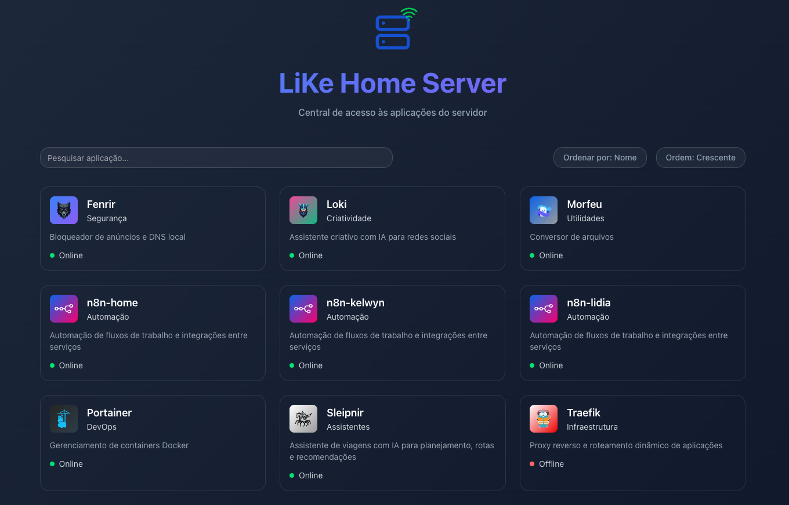
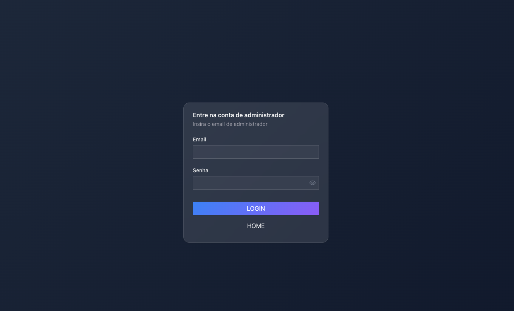
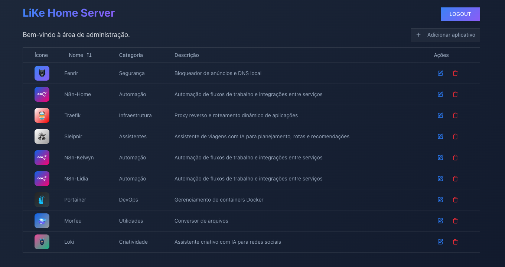

   

# 🏡 LiKe Home Server Portal

A private dashboard to access, organize, and monitor all self-hosted services in our home. Fully built with **Next.js + TypeScript + Docker**.

---

## 💡 About the Project

The **LiKe Home Server Portal** is a centralized portal designed to manage and access my self-hosted applications. It provides an intuitive interface to display the status of my applications (online/offline) and quickly find them, making my home server environment more efficient to navigate.

---

## 🎯 Purpose

- ✅ **Personal**: A reliable and clean interface to manage internal tools used at home.
- 🚀 **Professional**: A demonstration of my ability to design, build, and deploy complete systems.

---

## 🖼️ Preview

### Home page



### Login Page



### Admin Page



---

---

## 🧠 Features

- **Application Portal:** A web interface to list and access all my applications.
- **Filtering and Search:** Quickly search my applications by name, description, or category.
- **Status Monitoring** – Shows whether each app is online/offline (ping check)
- **Responsive Design:** Adapts seamlessly to various screen sizes.
- **Admin Area** – Login-protected panel to create, edit and delete apps
- **Persistent Storage** – Uses a JSON file as the single source of truth
- **Auth via Cookie** – Login creates a secure cookie with persistence
- **Easy Setup:** Managed via Docker for simplified deployment.

---

## 🔐 Authentication

Admin login is protected using credentials defined in `.env`. After successful login, a secure cookie is set with 24h expiration to maintain admin state.

```ts
// src/app/login/_actions/login.ts
cookieStore.set("admin_logged", "true", {
  httpOnly: true,
  path: "/",
  maxAge: 60 * 60 * 24,
});
```

---

## 📦 Why JSON Instead of a Database?

For a small-scale internal system with low-frequency updates, a simple apps.json file offers:

- Zero setup or maintenance overhead
- Persistent and human-readable format
- Perfect fit for Docker volume mounting
- No external service dependencies

It’s a pragmatic choice — fast, lightweight, and perfectly tailored for this use case.

---

## 📁 File Structure (Simplified)

```
├── src
│   ├── app
│   │   ├── _home             # Public homepage
│   │   ├── admin             # Admin dashboard
│   │   ├── api               # Status check & API routes
│   │   ├── login             # Admin login system
│   ├── data
│   │   └── apps.json         # Core data source (acts as DB)
│   └── components            # UI primitives
├── public
│   ├── assets
│   │   └── apps-images       # App icons
│   └── favicon/             # Custom favicon set
├── docker-compose.yml
├── Dockerfile
```

---

## 🚀 Running the Portal

Set the credentials (.env file):

```
ADMIN_EMAIL=your@email.com
ADMIN_PASSWORD=password
```

Make sure to mount the correct volumes for:

- /src/data/apps.json
- /public/assets/apps-images/

Example:

```yml
volumes:
  - /mnt/ssd/portal-like/src/data/:/app/src/data/
  - /mnt/ssd/portal-like/public/assets/apps-images:/app/public/assets/apps-images
```

Run docker compose

```bash
docker-compose up -d --build
```

---

### 🌐 Accessing the Portal

Access it via:

```bash
http://localhost:3000
```

---

### 🧪 Status Check Logic

Each app listed in apps.json is pinged by a serverless route (/api/status-check) to update its status (online/offline) on the homepage.

---

## 📌 Notes

- Fully self-hosted and manually maintained (no CI/CD).
- Favicon and dynamic images work locally and in Docker (with volume mounts).
- Changes made via the admin panel persist instantly via apps.json.
